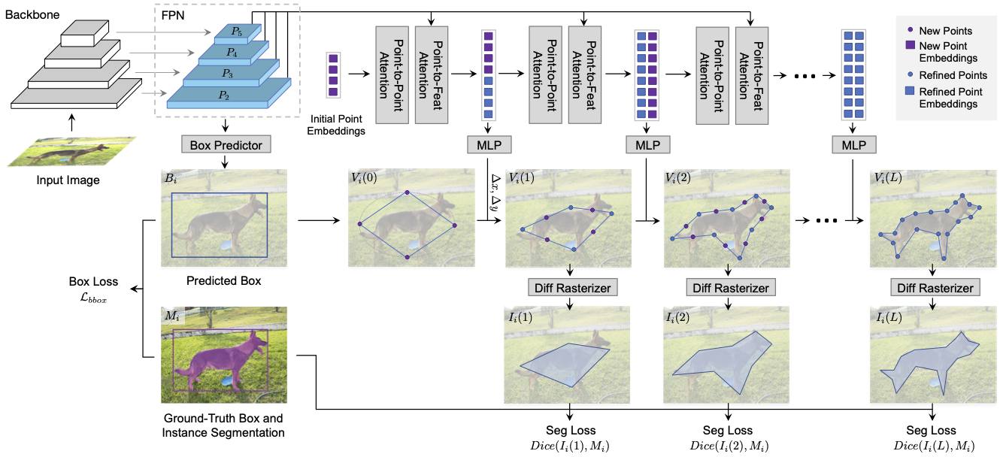

# Instance Segmentation With Mask-Supervised Polygonal Boundary Transformers

From [Justin Lazarow (UCSD, now at Apple)](),  [Weijian Xu (UCSD, now at Microsoft)](https://weijianxu.com), and [Zhuowen Tu (UCSD)](https://pages.ucsd.edu/~ztu).

This repository is an official implementation of the paper [Instance Segmentation With Mask-Supervised Polygonal Boundary Transformers](https://openaccess.thecvf.com/content/CVPR2022/papers/Lazarow_Instance_Segmentation_With_Mask-Supervised_Polygonal_Boundary_Transformers_CVPR_2022_paper.pdf) presented at CVPR 2022.

## Introduction

BoundaryFormer aims to provide a simple baseline for _regression-based_ instance segmentation. Notably, we use Transformers to regress a fixed number of points along
a simple polygonal boundary. This process makes continuous predictions and is thus end-to-end differentiable. Our method differs from previous work in the field in two
main ways: our method can match Mask R-CNN in Mask AP for the first time and we impose no additional supervision or ground-truth requirements as Mask R-CNN. That is,
our method achieves parity in mask quality and supervision to mask-based baselines. We accomplish this by solely relying on a differentiable rasterization module (implemented in CUDA)
which only requires access to ground-truth masks. We hope this can serve to drive further work in this area.



## Installation

BoundaryFormer uses the same installation process as Detectron2. Please see [installation instructions](https://detectron2.readthedocs.io/tutorials/install.html). This
should generally require something like:

``` shell
pip install -ve .
```

at the root of the source tree (as long as PyTorch, etc are installed correctly.

BoundaryFormer also uses the deformable attention modules introduced in [Deformable-DETR](https://github.com/fundamentalvision/Deformable-DETR). If this
is already installed on your system, no action is needed. Otherwise, please build their modules:

```
git clone https://github.com/fundamentalvision/Deformable-DETR
cd Deformable-DETR/models/ops
sh ./make.sh
# unit test (should see all checking is True)
python test.py
```

## Getting Started

BoundaryFormer follows the general guidelines of Detectron2, however, it lives under ```projects/BoundaryFormer```.

Please make sure to set two additional environmental variables on your system:

``` shell

export DETECTRON2_DATASETS=/path/to/datasets
export DETECTRON2_OUTPUTS=/path/to/outputs
```

For instance, to train on COCO using an R50 backbone at a 1x schedule:

``` python
python projects/BoundaryFormer/train_net.py --num-gpus 8 --config-file projects/BoundaryFormer/configs/COCO-InstanceSegmentation/boundaryformer_rcnn_R_50_FPN_1x.yaml COMMENT "hello model"
```

If you do not have 8 GPUs, adjust --num-gpus and your BATCH_SIZE accordingly. BoundaryFormer is trained with AdamW and we find the square-root scaling law to work well (i.e., a batch size of 8 should only induce a sqrt(2) change in LR).

## Relevant Hyperparameters/Configuration Options

BoundaryFormer has a few hyperparameter options. Generally, these are configured under ```cfg.MODEL.BOUNDARY_HEAD``` (see ```projects/BoundaryFormer/boundary_former/config.py```). Please
see the paper for ablations of these values.

### Number of layers

``` shell

cfg.MODEL.BOUNDARY_HEAD.NUM_DEC_LAYERS = 4

```

We generally find that 4 layers is sufficient for good performance. A small amount of performance is lost by reducing this to 3 and otherwise increasing it doesn't generally change performance.

***NOTE:*** if upsampling is used, this is generally ignored and computed by a combination of ```cfg.MODEL.BOUNDARY_HEAD.POLY_NUM_PTS``` and ```cfg.MODEL.BOUNDARY_HEAD.UPSAMPLING_BASE_NUM_PTS```.

### Number of control points

``` shell

cfg.MODEL.BOUNDARY_HEAD.POLY_NUM_PTS = 64

```

This defines the number of points at the _final_ output layer. If upsampling (see next section) is not used, this also constitutes the number of points at any intermediate layer. Generally,
we find Cityscapes to benefit from more than 64 points (e.g. 128) but COCO less so.


### Upsampling behavior

Upsampling constitutes our coarse-to-fine strategy which can reduce memory and computation. Rather than using the same number of points at each layer, we start off with a small number
of points and upsample (2x) the points in a naive manner (midpoints) at each subsequent layer. To enable:

``` shell
cfg.MODEL.BOUNDARY_HEAD.UPSAMPLING = True
cfg.MODEL.BOUNDARY_HEAD.UPSAMPLING_BASE_NUM_PTS = 8
cfg.MODEL.BOUNDARY_HEAD.POLY_NUM_PTS = 64
```

This will create a 4-layer (8 * 2 ** 3 = 64) coarse-to-fine model


### Rasterization resolution

BoundaryFormer uses differentiable rasterization to transform the predicted polygons into mask space for supervision. To control the resolution:


```
cfg.MODEL.DIFFRAS.RESOLUTIONS = [64, 64]
```

is a flattened (e.g. for X and Y resolutions) list. This can be modified per layer by expanding it. For a two-layer model:

```
cfg.MODEL.DIFFRAS.RESOLUTIONS = [32, 32, 64, 64]
```

would supervise the first layer at 32 x 32 and the second at 64 x 64.

### Rasterization smoothness

In the same way as [SoftRas](https://github.com/ShichenLiu/SoftRas), we require some rasterization smoothness to differentiably rasterize the masks.

```
    cfg.MODEL.DIFFRAS.INV_SMOOTHNESS_SCHED = (0.001,)
```

will produce quite sharp rasterization (larger values will be "blurrier") which seems to work well. This can also be made to be dependent on the current
iteration:

```
    cfg.MODEL.DIFFRAS.INV_SMOOTHNESS_SCHED = (0.15, 0.005)
    cfg.MODEL.DIFFRAS.INV_SMOOTHNESS_STEPS = (50000,)
```

to initially start with 0.15 and drop to 0.005 at iteration 50000. This hyperparameter is not particularly sensitive in our experience, however, too large of values
will decrease performance.

## Model Zoo

We release models for MS-COCO and Cityscapes.

### COCO

<table><tbody>
<!-- START TABLE -->
<!-- TABLE HEADER -->
<th valign="bottom">Mask<br/>head</th>
<th valign="bottom">Backbone</th>
<th valign="bottom">lr<br/>sched</th>
<th valign="bottom">Control<br/>points</th>
<th valign="bottom">mask<br/>AP</th>
<th valign="bottom">download</th>
<!-- TABLE BODY -->
 <tr><td align="left"><a href="projects/BoundaryFormer/configs/COCO-InstanceSegmentation/boundaryformer_rcnn_R_50_FPN_1x.yaml">BoundaryFormer</a></td>
<td align="center">R50-FPN</td>
<td align="center">1&times;</td>
<td align="center">64</td>
<td align="center">36.1</td>
<td align="center"><a href="https://drive.google.com/file/d/1eoq94Qot2z-YrJ6yg0tfUKNrKpQfh0YS/view?usp=sharing">model</a></td>
</tr>
</tbody></table>


### Cityscapes

<table><tbody>
<!-- START TABLE -->
<!-- TABLE HEADER -->
<th valign="bottom">Mask<br/>head</th>
<th valign="bottom">Backbone</th>
<th valign="bottom">lr<br/>sched</th>
<th valign="bottom">Control<br/>points</th>
<th valign="bottom">initialization</th>
<th valign="bottom">mask<br/>AP</th>
<th valign="bottom">download</th>
<!-- TABLE BODY -->
 <tr><td align="left"><a href="projects/BoundaryFormer/configs/Cityscapes/boundaryformer_rcnn_R_50_FPN_1x.yaml">BoundaryFormer</a></td>
<td align="center">R50-FPN</td>
<td align="center">1&times;</td>
<td align="center">64</td>
<td align="center">ImageNet</td>
<td align="center">34.7</td>
<td align="center"><a href="https://drive.google.com/file/d/1HnX2ESxDrS0V-d2Ttp3CZ7Gxe-kVvYrg/view?usp=sharing">model</a></td>
</tr>
 <tr><td align="left"><a href="projects/BoundaryFormer/configs/Cityscapes/boundaryformer_rcnn_R_50_FPN_1x.yaml">BoundaryFormer</a></td>
<td align="center">R50-FPN</td>
<td align="center">1&times;</td>
<td align="center">64</td>
<td align="center">COCO</td>
<td align="center">38.3</td>
<td align="center"><a href="https://drive.google.com/file/d/1EEEO2zx9wUElK1zb6uX3Zb_GaLNfSiEt/view?usp=sharing">model</a></td>
</tr>
</tbody></table>

## License

BoundaryFormer uses Detectron2 and is further released under the [Apache 2.0 license](LICENSE).

## Citing BoundaryFormer

If you use BoundaryFormer in your research, please use the following BibTeX entry.

```BibTeX
@InProceedings{Lazarow_2022_CVPR,
    author    = {Lazarow, Justin and Xu, Weijian and Tu, Zhuowen},
    title     = {Instance Segmentation With Mask-Supervised Polygonal Boundary Transformers},
    booktitle = {Proceedings of the IEEE/CVF Conference on Computer Vision and Pattern Recognition (CVPR)},
    month     = {June},
    year      = {2022},
    pages     = {4382-4391}
}
```
